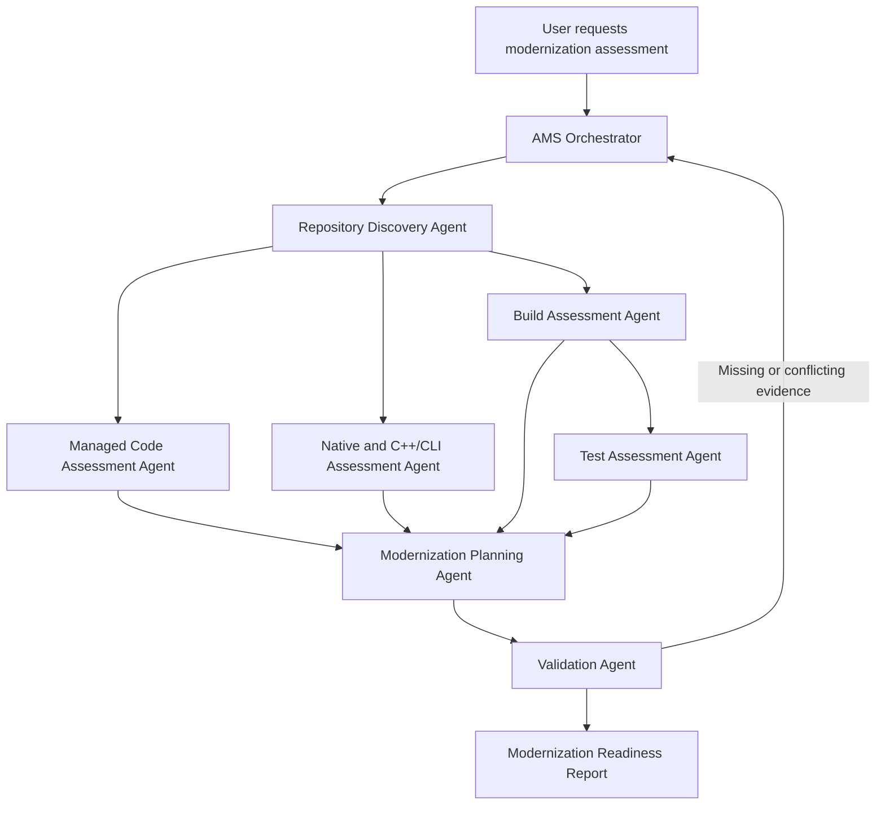

# Agentic Modernization Scout

**Agentic Modernization Scout (AMS)** is a multi-agent workflow for assessing legacy software repositories and producing evidence-based modernization plans.

AMS analyzes a repository from multiple perspectives—including managed code, native code, C++/CLI interoperability, dependencies, build health, tests, and migration risk—and combines the findings into a structured modernization readiness report.

## Purpose

Large legacy repositories are rarely modernized through a single framework upgrade or automated conversion.

They often contain a combination of:

* .NET Framework applications
* Native C++ libraries
* C++/CLI mixed-mode assemblies
* WPF and WinForms user interfaces
* Third-party UI frameworks
* Legacy build systems
* Platform-specific dependencies
* Limited automated test coverage
* Complex project dependency chains

AMS coordinates specialized agents to inspect these areas, validate their findings, and recommend a practical modernization path.

## Goals

AMS is intended to:

* Discover the structure of a large repository
* Identify project types, frameworks, and dependencies
* Generate a repository dependency graph
* Detect modernization blockers
* Assess managed, native, and mixed-mode code separately
* Build and test the repository where possible
* Distinguish source-code issues from environment issues
* Estimate modernization readiness
* Recommend a dependency-aware migration order
* Produce traceable modernization work items
* Prevent unsupported or hallucinated recommendations

## Core Workflow



## Agents

### Repository Discovery Agent

Creates an inventory of the repository.

Responsibilities include:

* Locate solutions and projects
* Detect project types
* Identify target frameworks
* Discover project references
* Detect native and managed boundaries
* Identify third-party dependencies
* Locate test projects
* Determine build entry points
* Produce the initial dependency graph

Example output:

```json
{
  "projects": [],
  "dependencies": [],
  "buildOrder": [],
  "entryPoints": [],
  "testProjects": []
}
```

### Managed Code Assessment Agent

Analyzes managed C# and .NET projects.

Checks include:

* .NET Framework-only APIs
* Unsupported or obsolete APIs
* WPF and WinForms usage
* Windows-specific dependencies
* Legacy configuration patterns
* Binary serialization
* COM interoperability
* Old NuGet packages
* Telerik, DevExpress, or similar UI dependencies
* Candidate target frameworks
* Potential compatibility risks

### Native and C++/CLI Assessment Agent

Analyzes native C++ and mixed-mode projects.

Checks include:

* Native library dependencies
* C++/CLI `/clr` usage
* Mixed-mode assemblies
* Runtime coupling
* P/Invoke boundaries
* COM dependencies
* Exported native APIs
* Managed-to-native bridge patterns
* Compiler and toolset dependencies
* Feasibility of modern .NET interoperability

### Build Assessment Agent

Attempts to restore and build the repository.

Responsibilities include:

* Detect required SDKs and toolchains
* Restore package dependencies
* Execute supported build commands
* Capture errors and warnings
* Identify the first blocking failure
* Categorize failures
* Distinguish environment failures from source failures
* Avoid repeating identical failed build attempts

### Test Assessment Agent

Analyzes and executes available automated tests.

Responsibilities include:

* Discover test projects and frameworks
* Run available tests
* Report passed and failed tests
* Identify projects without tests
* Highlight high-risk untested areas
* Assess whether existing tests are sufficient for modernization
* Recommend characterization tests where required

### Modernization Planning Agent

Combines the assessment results into a modernization strategy.

Produces:

* Modernization readiness score
* Dependency-aware migration sequence
* Key blockers
* Technical risks
* Recommended proof of concept
* Suggested target architecture
* Workstreams
* Candidate backlog items
* Validation and rollback recommendations

### Validation Agent

Reviews the final assessment for quality and traceability.

The validation agent ensures that:

* Recommendations are supported by repository evidence
* Referenced files and projects exist
* Build conclusions match build logs
* Risk ratings are consistent
* Conflicting findings are resolved
* Unsupported assumptions are removed
* Missing evidence is explicitly identified

## Agentic Behavior

AMS is more than a collection of independent prompts.

The orchestrator makes decisions based on repository findings.

Examples:

* Run the native assessment only when native C++ projects are detected.
* Run the C++/CLI assessment only when `/clr` or mixed-mode projects exist.
* Run UI-specific compatibility checks only when WPF, WinForms, Telerik, DevExpress, or similar dependencies are found.
* Stop repeated build attempts after the same failure occurs more than once.
* Request additional evidence when agents report conflicting dependencies.
* Re-run the planning agent when validation identifies unsupported conclusions.
* Escalate high-impact migration decisions for human approval.
* Require every recommendation to reference a file, project, dependency, or execution result.

## Proposed Repository Structure

```text
agentic-modernization-scout/
├── README.md
├── orchestrator/
│   ├── orchestrator.md
│   ├── routing-rules.yaml
│   └── workflow-state.schema.json
├── agents/
│   ├── repository-discovery.agent.md
│   ├── managed-assessment.agent.md
│   ├── native-assessment.agent.md
│   ├── build-assessment.agent.md
│   ├── test-assessment.agent.md
│   ├── modernization-planner.agent.md
│   └── validation.agent.md
├── schemas/
│   ├── repository-inventory.schema.json
│   ├── dependency-graph.schema.json
│   ├── assessment-result.schema.json
│   ├── modernization-plan.schema.json
│   └── validation-result.schema.json
├── scripts/
│   ├── run-ams.ps1
│   └── run-ams.py
├── prompts/
├── samples/
├── tests/
└── outputs/
    ├── inventory/
    ├── assessments/
    ├── build/
    ├── tests/
    └── reports/
```

## Shared Workflow State

Agents should communicate through structured files rather than relying entirely on conversational context.

Example workflow state:

```json
{
  "assessmentId": "ams-001",
  "repositoryPath": "./sample-repository",
  "status": "in-progress",
  "detectedProjectTypes": [
    "csharp",
    "cpp",
    "cpp-cli"
  ],
  "completedAgents": [
    "repository-discovery"
  ],
  "pendingAgents": [
    "managed-assessment",
    "native-assessment",
    "build-assessment"
  ],
  "findings": [],
  "conflicts": [],
  "humanApprovals": []
}
```

## Example Final Report

```text
Modernization readiness: 58/100

Primary blocker:
Bridge.vcxproj is a C++/CLI mixed-mode project targeting .NET Framework
4.8 and directly referencing three native libraries.

Recommended first step:
Create a proof of concept that exposes one existing native operation
through a modernized C++/CLI or C-compatible interoperability boundary
to a .NET application.

Recommended migration order:
1. Shared native libraries
2. Native interoperability contracts
3. C++/CLI bridge projects
4. Non-UI managed libraries
5. WPF and WinForms projects
6. Main executable
7. Packaging and deployment
```

## Modernization Readiness Areas

The readiness score may consider:

| Area                    | Example Considerations                                 |
| ----------------------- | ------------------------------------------------------ |
| Repository structure    | Project discoverability and dependency clarity         |
| Build health            | Reproducibility and number of blocking failures        |
| Framework compatibility | Supported target frameworks and API usage              |
| Native interoperability | Complexity of native and managed boundaries            |
| Dependency health       | Package age, support status, and platform restrictions |
| Test readiness          | Coverage, reliability, and characterization tests      |
| Deployment              | Installer, runtime, and packaging dependencies         |
| Architecture            | Coupling, modularity, and migration seams              |
| Operational readiness   | Logging, diagnostics, rollback, and monitoring         |

## Initial Implementation Plan

### Phase 1: Repository Discovery

* Implement project and solution discovery
* Generate repository inventory
* Build an initial dependency graph
* Store results as structured JSON

### Phase 2: Specialized Assessments

* Add managed code assessment
* Add native and C++/CLI assessment
* Add package and dependency analysis

### Phase 3: Tool Execution

* Add build execution
* Add test execution
* Capture logs and categorize failures

### Phase 4: Planning

* Generate readiness scores
* Produce migration sequence
* Create modernization backlog recommendations

### Phase 5: Validation

* Add evidence validation
* Add conflict detection
* Add retry and re-assessment rules
* Add human approval gates

### Phase 6: Parallelization

* Run independent assessments concurrently
* Preserve deterministic shared state
* Merge findings through the orchestrator

## Guiding Principles

### Evidence Before Recommendation

Every important conclusion should reference repository evidence.

Valid evidence includes:

* Project files
* Source files
* Configuration files
* Package manifests
* Build logs
* Test results
* Dependency relationships
* Compiler settings

### Incremental Modernization

AMS should recommend small, testable modernization steps instead of assuming the entire repository can be migrated at once.

### Dependency-Aware Planning

Projects should not be prioritized only by size or apparent simplicity. Migration order must account for dependency direction and runtime coupling.

### Human Approval for High-Impact Decisions

Decisions such as replacing a UI framework, changing interoperability boundaries, or redesigning deployment architecture should require human review.

### Structured Agent Communication

Agents should exchange validated JSON documents using defined schemas.

### Repeatable Execution

Running AMS against the same repository and configuration should produce comparable results.

## Current Status

AMS is currently an exploratory project intended to demonstrate:

* Multi-agent specialization
* Agent orchestration
* Tool-driven repository analysis
* Conditional routing
* Shared workflow state
* Validation loops
* Retry policies
* Human-in-the-loop modernization planning

## Future Ideas

Potential future capabilities include:

* GitHub and Azure DevOps integration
* Pull request modernization reviews
* Automated dependency graph visualization
* API compatibility scanning
* Binary dependency inspection
* Technical debt trend analysis
* Migration backlog generation
* Cost and effort estimation
* Architecture decision record generation
* Continuous modernization monitoring
* Comparison of assessment results across branches
* Integration with GitHub Copilot coding agents

## License

MIT

## Contributing

Contribution guidance will be added as the project structure and implementation approach mature.
