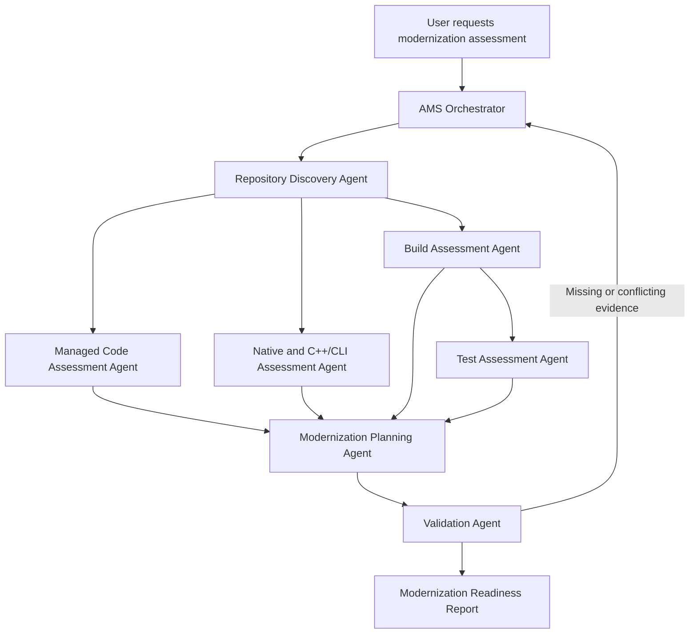

# Agentic Modernization Scout

**Agentic Modernization Scout (AMS)** is a multi-agent workflow for assessing legacy software repositories and producing evidence-based modernization plans.

AMS analyzes a repository from multiple perspectives—including managed code, native code, C++/CLI interoperability, dependencies, build health, tests, and migration risk—and combines the findings into a structured modernization readiness report.

## Purpose

Large legacy repositories are rarely modernized through a single framework upgrade or automated conversion.

They often contain a combination of:

- .NET Framework applications
- Native C++ libraries
- C++/CLI mixed-mode assemblies
- WPF and WinForms user interfaces
- Third-party UI frameworks
- Legacy build systems
- Platform-specific dependencies
- Limited automated test coverage
- Complex project dependency chains

AMS coordinates specialized agents to inspect these areas, validate their findings, and recommend a practical modernization path.

## Goals

AMS is intended to:

- Discover the structure of a large repository
- Identify project types, frameworks, and dependencies
- Generate a repository dependency graph
- Detect modernization blockers
- Assess managed, native, and mixed-mode code separately
- Build and test the repository where possible
- Distinguish source-code issues from environment issues
- Estimate modernization readiness
- Recommend a dependency-aware migration order
- Produce traceable modernization work items
- Prevent unsupported or hallucinated recommendations

## Core Workflow



## Agents

- Repository Discovery Agent
- Managed Code Assessment Agent
- Native and C++/CLI Assessment Agent
- Build Assessment Agent
- Test Assessment Agent
- Modernization Planning Agent
- Validation Agent

Detailed prompts/specs for each agent are in `/agents`.

## Repository Structure

```text
agentic-modernization-scout/
├── README.md
├── orchestrator/
│   ├── orchestrator.md
│   ├── routing-rules.yaml
│   └── workflow-state.schema.json
├── agents/
│   ├── repository-discovery.agent.md
│   ├── managed-assessment.agent.md
│   ├── native-assessment.agent.md
│   ├── build-assessment.agent.md
│   ├── test-assessment.agent.md
│   ├── modernization-planner.agent.md
│   └── validation.agent.md
├── schemas/
│   ├── repository-inventory.schema.json
│   ├── dependency-graph.schema.json
│   ├── assessment-result.schema.json
│   ├── modernization-plan.schema.json
│   └── validation-result.schema.json
├── scripts/
│   ├── run-ams.ps1
│   └── run-ams.py
├── prompts/
├── samples/
├── tests/
└── outputs/
    ├── inventory/
    ├── assessments/
    ├── build/
    ├── tests/
    └── reports/
```

## Shared Workflow State

Agents communicate through structured JSON files and must not rely solely on conversational context. The schema is available at `orchestrator/workflow-state.schema.json`.

## Example Final Report

```text
Modernization readiness: 58/100

Primary blocker:
Bridge.vcxproj is a C++/CLI mixed-mode project targeting .NET Framework
4.8 and directly referencing three native libraries.

Recommended first step:
Create a proof of concept that exposes one existing native operation
through a modernized C++/CLI or C-compatible interoperability boundary
to a .NET application.

Recommended migration order:
1. Shared native libraries
2. Native interoperability contracts
3. C++/CLI bridge projects
4. Non-UI managed libraries
5. WPF and WinForms projects
6. Main executable
7. Packaging and deployment
```

## Initial Implementation Status

This repository includes:

- Initial orchestrator routing and state schema
- Agent role definitions
- Baseline output schemas
- Starter execution scripts (`scripts/run-ams.py`, `scripts/run-ams.ps1`)
- Output folders for generated artifacts

## Running AMS (starter flow)

```bash
python scripts/run-ams.py --repository-path ./sample-repository --assessment-id ams-001
```

PowerShell:

```powershell
./scripts/run-ams.ps1 -RepositoryPath ./sample-repository -AssessmentId ams-001
```

Generated files are written under `outputs/`.

## Guiding Principles

- Evidence before recommendation
- Incremental modernization
- Dependency-aware planning
- Human approval for high-impact decisions
- Structured agent communication
- Repeatable execution

## License

MIT (the repository includes `LICENSE` at the root).

## Contributing

Contribution guidance will be added as the implementation matures.
